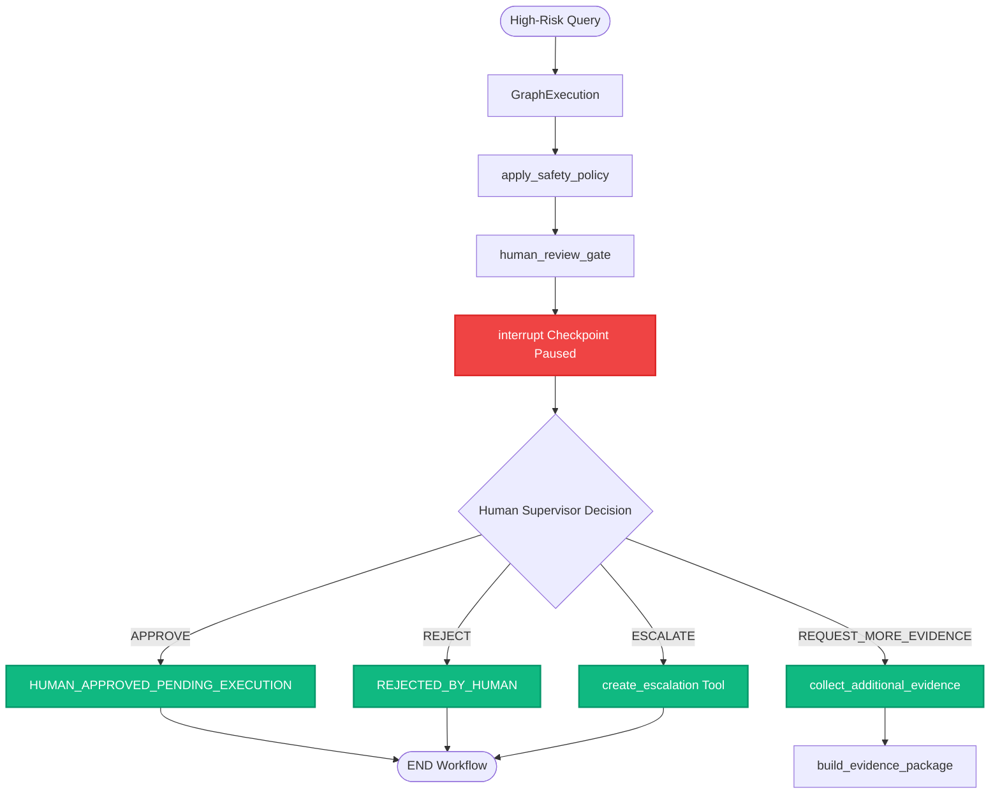

# PickGuard AI — Human-in-the-Loop Interrupt & Recovery Walkthrough

## Overview
This document demonstrates the production-grade **LangGraph `interrupt()` checkpoint** workflow implemented in PickGuard AI for high-risk pick exception resolution.

---

## The High-Risk Decision Scenario

1. **Operator Query:**
   `"TASK-1003 quantity mismatch: System says 10 units of X125 at A20-B02 but I counted 6. Update inventory to 6."`

2. **Graph Traversal to Interrupt Gate:**
   - **`parse_operator_query`**: Extracts `task_id = "TASK-1003"`, `item_id = "X125"`, `location_id = "A20-B02"`.
   - **`classify_exception`**: Identifies `primary = "QUANTITY_MISMATCH"`.
   - **`fetch_operational_evidence`**: Retrieves WMS pick task requirements (10 units expected) and system inventory.
   - **`retrieve_sop_evidence`**: Retrieves `SOP-QTY-001` (Quantity Mismatch SOP).
   - **`retrieve_historical_evidence`**: Retrieves historical incident logs.
   - **`build_evidence_package`**: Synthesizes facts, SOP rules, and historical resolutions.
   - **`reason_over_evidence`**: LLM interprets evidence.
   - **`fuse_evidence`**: Rates evidence quality (`STRONG`).
   - **`detect_evidence_conflicts`**: Flags `QUANTITY_CONFLICT` (System 10 vs Physical 6).
   - **`select_next_best_action`**: Selects candidate action `ADJUST_QUANTITY`.
   - **`apply_safety_policy`**: Safety policy overrides `ADJUST_QUANTITY` to `BLOCKED`, sets `risk_level = "HIGH"`, `requires_human_review = True`, and proposed next step `RECOUNT_QUANTITY`.

3. **LangGraph Interrupt Gate Execution:**
   - `human_review_gate` detects `requires_human_review == True`.
   - Audit trail records: `"LangGraph interrupt checkpoint reached: pausing execution for human review"`.
   - Execution pauses using real LangGraph `interrupt(payload)`. State is saved to `MemorySaver` checkpointer under `thread_id = "demo-task-1003"`.

---

## Human Review Payload Structure

```json
{
  "type": "human_review_required",
  "task_id": "TASK-1003",
  "exception_type": "QUANTITY_MISMATCH",
  "risk_level": "HIGH",
  "reason": "Consequential action 'ADJUST_QUANTITY' is BLOCKED automatically.; Evidence conflicts detected (1 active conflicts).",
  "recommended_action": "RECOUNT_QUANTITY",
  "action_status": "BLOCKED",
  "evidence_quality": "STRONG",
  "evidence_conflicts": [
    {
      "type": "QUANTITY_CONFLICT",
      "description": "Physical observation differs from system inventory record (system reports 10 units).",
      "severity": "HIGH"
    }
  ],
  "supporting_evidence": {
    "operational": [
      "Pick Task: TASK-1003",
      "Inventory: X125 @ A20-B02 (10 units)",
      "Location Mapping: A20-B02 (Zone Z02)"
    ],
    "sop": ["SOP-QTY-001 v1.0 Section 'Physical Recount Protocol'"],
    "historical": ["Incident INC-0003 (RECOUNT_QUANTITY)"]
  },
  "review_question": "Approve recommendation, reject, request more evidence, or escalate?"
}
```

---

## Command Resume Flow & Human Decision Handling

When the human supervisor submits a decision, the graph is resumed via `Command(resume=payload)` targeting the same `thread_id`.



### Action Status Outcomes
1. **`APPROVE`:** Sets `action_status = "HUMAN_APPROVED_PENDING_EXECUTION"`. Inventory is **NOT** automatically modified; approval is flagged for operator pick line execution.
2. **`REJECT`:** Sets `action_status = "REJECTED_BY_HUMAN"`. Recommendation is canceled.
3. **`REQUEST_MORE_EVIDENCE`:** Increments `review_attempts`, routes to `collect_additional_evidence`, and re-evaluates graph. Max 2 attempts allowed before auto-escalating.
4. **`ESCALATE`:** Invokes `create_escalation()` tool, creates synthetic SQLite escalation record, and sets `action_status = "ESCALATED"`.
