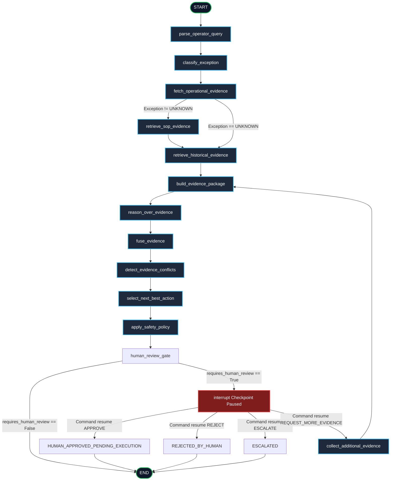

# PickGuard AI — LangGraph Workflow Architecture

## Overview
This document illustrates the compiled **LangGraph `StateGraph`** workflow with real `interrupt()` checkpointing and state persistence via `MemorySaver`.

> [!NOTE]
> **Phase 8 Scope:** The workflow handles deterministic parsing, classification, tools, SOP RAG, historical search, LLM reasoning, evidence fusion, conflict detection, action selection, safety policy enforcement, and real LangGraph `interrupt()` human-in-the-loop review.

---

## Workflow Graph Diagram (Mermaid)

---

## Node Responsibilities & Specifications

| Node # | Node Name | Input State Fields | Output State Fields | Responsibilities |
| :---: | :--- | :--- | :--- | :--- |
| **1** | `parse_operator_query` | `operator_query` | `task_id`, `item_id`, `location_id`, `order_id`, `audit_log` | Extracts identifiers via regex without hallucination. |
| **2** | `classify_exception` | `operator_query` | `exception_type`, `secondary_exception_types`, `audit_log` | Maps query to 6 supported exception types or `UNKNOWN`. |
| **3** | `fetch_operational_evidence` | `task_id`, `item_id`, `location_id` | `operational_data`, `errors`, `audit_log` | Calls Phase 3 tools (`get_pick_task`, `get_inventory`, `get_location`). |
| **4** | `retrieve_sop_evidence` | `exception_type`, `operator_query` | `sop_evidence`, `errors`, `audit_log` | Queries Phase 4 ChromaDB RAG retriever for grounded SOP chunks. |
| **5** | `retrieve_historical_evidence` | `item_id`, `location_id`, `exception_type` | `historical_evidence`, `audit_log` | Queries Phase 3 incident search tool for prior resolutions. |
| **6** | `build_evidence_package` | All state evidence fields | `evidence_summary`, `provider`, `model_name`, `audit_log` | Assembles structured evidence package (`OBSERVED_FACTS`, `SOP_EVIDENCE`, `HISTORICAL_EVIDENCE`, `INFERENCES`, `EVIDENCE_GAPS`). |
| **7** | `reason_over_evidence` | `evidence_summary`, `operator_query` | `reasoning`, `root_cause`, `recommended_action`, `confidence` | Invokes LLM provider over the evidence package. |
| **8** | `fuse_evidence` | All evidence fields | `evidence_quality`, `provenance` | Rates evidence quality (`STRONG`, `MODERATE`, `WEAK`, `INSUFFICIENT`) and compiles provenance. |
| **9** | `detect_evidence_conflicts` | `operational_data`, `operator_query` | `evidence_conflicts` | Identifies quantity, location, or SKU discrepancies. |
| **10** | `select_next_best_action` | `exception_type`, `operator_query` | `action_type`, `next_best_action` | Selects candidate verification action from controlled vocabulary. |
| **11** | `apply_safety_policy` | Candidate action, evidence quality | `action_status`, `risk_level`, `requires_human_review`, `review_reason` | Evaluates safety policy, overrides disallowed actions to `BLOCKED`, and sets human review triggers. |
| **12** | `human_review_gate` | `requires_human_review`, `review_attempts` | `human_decision`, `action_status`, `final_decision` | Pauses execution via real LangGraph `interrupt()`; handles `Command(resume=...)` decisions. |
| **13** | `collect_additional_evidence` | `item_id`, `location_id`, `exception_type` | `historical_evidence`, `audit_log` | Fetches extra evidence context upon supervisor request. |
