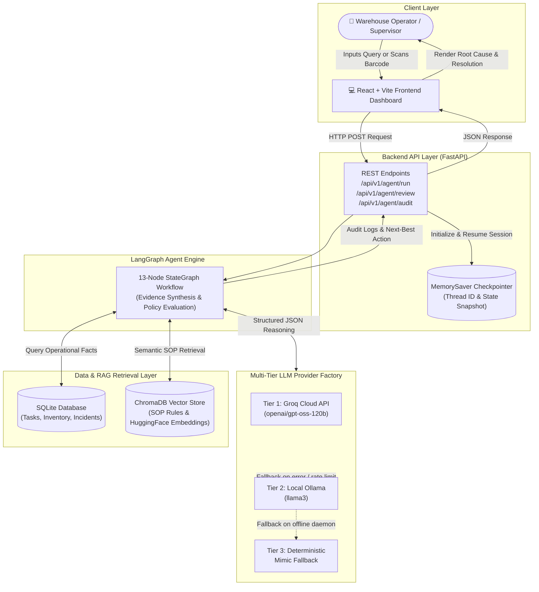
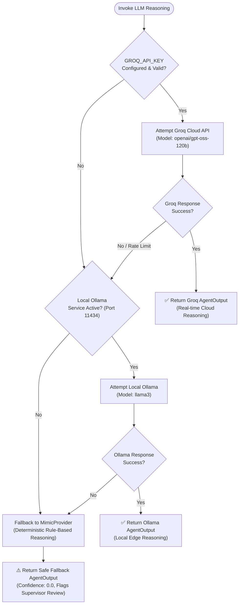
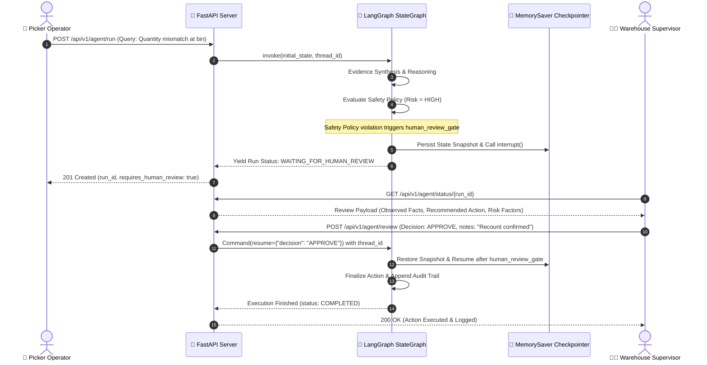
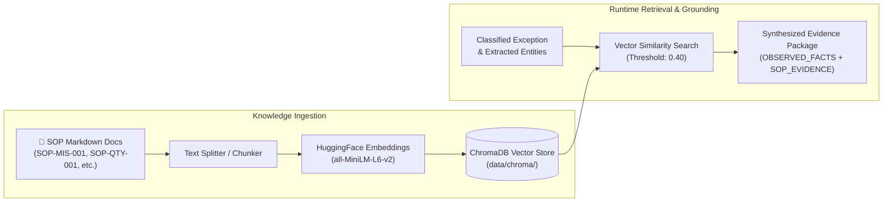

# PickGuard AI - Comprehensive System Flowcharts & Diagrams

This document provides visual diagrams and flowcharts explaining the end-to-end architecture, LangGraph execution graph, LLM fallback routing, and Human-in-the-Loop (HITL) safety workflows for PickGuard AI.

---

## 1. End-to-End System Architecture

This flowchart outlines the macro-architecture: from the operator frontend to the FastAPI router, LangGraph agent orchestration, RAG knowledge stores, multi-tier LLM providers, and operational databases.



---

## 2. LangGraph 13-Node StateGraph Workflow

This diagram represents the step-by-step execution path of the compiled `StateGraph(PickExceptionState)` located in `backend/app/graph/workflow.py`.

```mermaid
flowchart TD
    START(["▶ START"]) --> N1["1. parse_operator_query\n(Extract TASK, SKU, Bin IDs)"]
    N1 --> N2["2. classify_exception\n(MISSING_ITEM, QUANTITY_MISMATCH, etc.)"]
    N2 --> N3["3. fetch_operational_evidence\n(Query DB for Task & Inventory Records)"]

    N3 --> C1{"Route After\nClassification"}

    %% Conditional Branches
    C1 -->|Standard Exception| N4["4. retrieve_sop_evidence\n(ChromaDB Semantic Search)"]
    C1 -->|Historical Incident| N5["5. retrieve_historical_evidence\n(Query Past Resolutions)"]
    C1 -->|Missing Data / Unknown| N13["13. collect_additional_evidence\n(Request Recount / Photo Scan)"]

    N4 --> N6["6. build_evidence_package\n(Synthesize Facts, SOPs, Gaps)"]
    N5 --> N6
    N13 --> N6

    N6 --> N7["7. reason_over_evidence\n(LLM Structured AgentOutput)"]
    N7 --> N8["8. fuse_evidence\n(Merge Facts with LLM Inferences)"]
    N8 --> N9["9. detect_evidence_conflicts\n(Cross-Check Bin vs System Counts)"]
    N9 --> N10["10. select_next_best_action\n(Pick Action: RECOUNT, ESCALATE, etc.)"]
    N10 --> N11["11. apply_safety_policy\n(Deterministic ActionBoundary Checks)"]

    N11 --> C2{"Requires Human\nReview?"}

    C2 -->|Yes (High Risk / Policy Violation)| N12["12. human_review_gate\n(LangGraph interrupt() & HITL)"]
    C2 -->|No (Safe & High Confidence)| END_NODE(["⏹ END (Execution Complete)"])

    N12 --> C3{"Supervisor\nDecision"}
    C3 -->|APPROVE / MODIFY| END_NODE
    C3 -->|COLLECT_MORE_DATA| N13
    C3 -->|REJECT / ABORT| END_NODE
```

---

## 3. Multi-Tier LLM Provider & Automatic Failover Logic

The LLM provider factory (`backend/app/services/llm.py`) guarantees 100% uptime with graceful degradation across cloud, local edge, and deterministic fallbacks.



---

## 4. Human-in-the-Loop (HITL) Interrupt & Resume Lifecycle

Demonstrates how risky actions are halted using LangGraph checkpoint interrupts and safely resumed by warehouse supervisors.



---

## 5. Safety Policy & Action Boundary Enforcement

How deterministic warehouse safety rules prevent unauthorized inventory adjustments or invalid picks before any action is approved.

```mermaid
flowchart TD
    ActionIn(["Generated Action Proposal\nfrom reason_over_evidence"]) --> CheckBoundary{"Is Action within\nAutonomous Boundary?"}

    CheckBoundary -->|AUTO_CONFIRM_PICK / SAFE_REROUTE| CheckConfidence{"LLM Confidence\n>= 0.70 Threshold?"}
    CheckBoundary -->|FORCE_ADJUST_STOCK / OVERRIDE_SAFETY| TriggerViolation["❌ Boundary Violation:\nUnauthorized Action"]

    CheckConfidence -->|Yes (High Confidence)| CheckConflicts{"Evidence Conflicts\nDetected?"}
    CheckConfidence -->|No (Low Confidence)| FlagReview["⚠️ Flag for Supervisor Review"]

    CheckConflicts -->|None Detected| ApproveAction["✅ Action Approved\n(Status: EXECUTED)"]
    CheckConflicts -->|Conflicting Facts| FlagReview

    TriggerViolation --> SetHighRisk["Set Risk Level = HIGH\nrequires_human_review = True"]
    FlagReview --> SetHighRisk
    SetHighRisk --> RouteToGate["Route to human_review_gate"]
```

---

## 6. RAG Retrieval & Grounding Data Flow

Shows how standard operating procedures (SOPs) and historical warehouse incidents are retrieved via vector search to ground agent decisions in verified facts.


